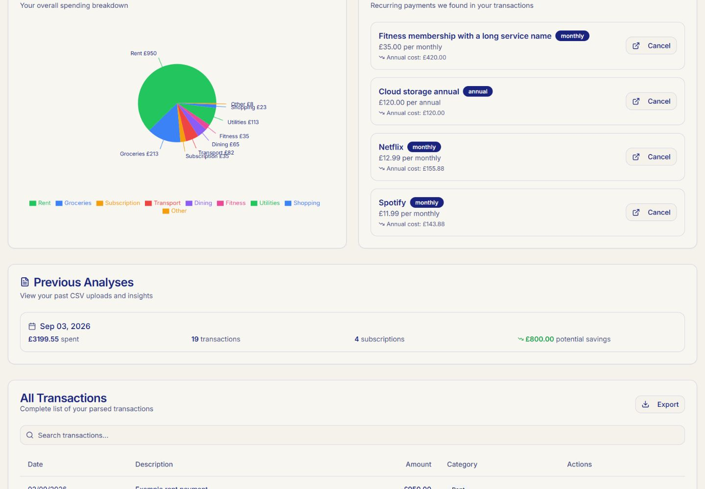
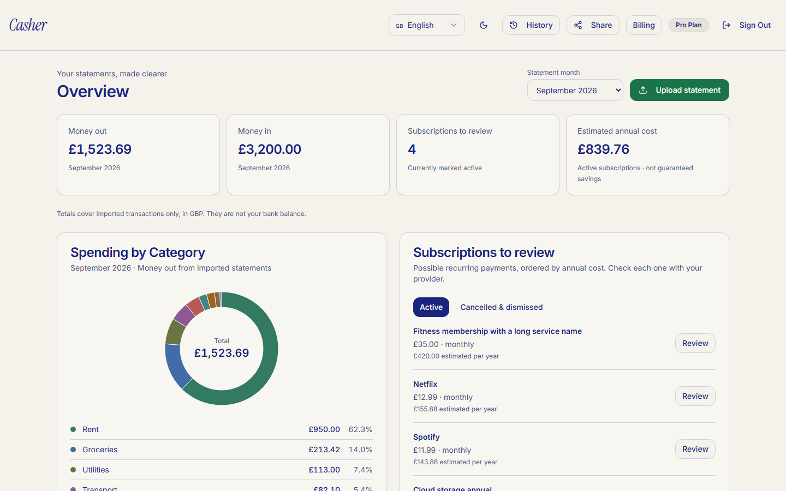

# Casher: product, UI and production-readiness audit

Audit date: 4 September 2026; implementation continued 5 September. Workspace: `D:\Projects\Coding\Casher`.

## Release verdict

**The current connected project should not yet be called production ready.** The local application now has substantial repairs and a reproducible verification workflow. The new import database function and updated edge functions still need staging acceptance and deployment. Historical records need reconciliation from original statements; new code cannot recover information that an earlier importer discarded.

The most serious problems were inconsistent financial calculations, fragile imports and misleading states. The broken-looking pie was a visible symptom of wider reliability problems. The revised interface keeps Casher's cream, navy and serif identity, gives the statement month and upload action prominence, and makes the underlying numbers inspectable.

## What was inspected

- Actual React application booted locally and inspected in the Codex in-app Browser. Before screenshots were captured before UI changes. Final Chromium screenshots and automated interaction checks cover 320, 390, 768 and 1440 px widths, plus dark mode and a mobile dialog.
- All routed areas: landing, authentication, dashboard, history, pricing, about, privacy, 404, and the non-admin access boundary. Admin code was reviewed; administrative mutations were not exercised against real users.
- CSV parsing, transaction direction, duplicate handling, upload quotas, database writes, subscription cancellation records, goals, export, authentication, billing, telemetry, dependency installation, builds and existing tests.
- Read-only inspection of the connected [Lovable project](https://lovable.dev/projects/ea77ebbb-78bd-46c4-a0c9-0ab73994a416), its database policies, function permissions and aggregate data health. No customer transaction descriptions, emails, credentials or real statements were copied into the sandbox.

The connected project was at commit `4c783505ad70ee92d4cf37461272470de079f310`. Its configuration points to Supabase project `ewnjmvxildwmbdmosasz`. Lovable's metadata reported `is_published: false`; that flag alone does not establish the status of every custom-domain deployment. The connected GitHub repository, `DannyWolfofTech/Casher`, has the identical commit. Git metadata has now been restored without replacing working files, and the fixes are prepared on `codex/production-hardening`. No live database writes, purchases, emails or production deployment were performed.

The local source backup is `%TEMP%\casher-before-audit-20260904.zip`. The repository history is the source-controlled baseline.

## Additional implemented corrections — 5 September

- Every transaction has a correction form for direction and category, plus a filter for records missing direction. Corrections affect dashboard/history calculations and signed CSV exports; imported amounts, descriptions and dates remain intact. There is no automatic guess-based backfill of customer records.
- Subscription review now supports amount/frequency corrections, dismissal of false detections, cancellation and restoration. Explicit payment corrections survive subsequent imports. Cancelled/dismissed records remain available for review.
- Two authenticated database functions enforce ownership, validate values, reject stale concurrent edits and record a private, immutable review history. PostgreSQL tests execute the actual migrations under separate authenticated identities, including cross-account denials and direct-write denials.
- Account/plan failures have retry controls and no longer appear as exhausted allowances or a free plan. Goals are cached per user and mutations check that a record was actually changed. OAuth session failures are handled; expired recovery links provide a route to request a new link.
- Paid-to-free changes go to billing management; checkout links reject credentials and unexpected ports. Import errors remain visible beside the file controls. Notifications have accessible dismiss controls and corrected semantics. Script evaluation and embedded objects are restricted further, though the remaining inline-script policy still needs hosting-level hardening.

Screenshots: [transaction correction on mobile](assets/after-transaction-correction.png), [subscription correction on mobile](assets/after-subscription-correction.png).

## Connected database findings

| Check | Observed result | Implication |
|---|---|---|
| Stored transactions | 490 rows; 481 have no explicit direction | Roughly 98% use legacy classification. Original statements are needed to validate money in/out and previously lost repeated purchases. |
| Required transaction fields | No null date, amount or description rows found | Useful integrity check, but not proof that amounts and classifications are correct. |
| Invalid goals | No nonpositive targets, negative saved values or blank titles found | New validation protects future writes. |
| Failed webhook records | 14, all `signature_verification_failed`, between 15 April and 4 September 2026 | Investigate signing-secret and endpoint configuration and the old signature implementation. These records do not prove 14 legitimate payments failed. |
| Row-level security | Enabled on all seven inspected financial/account tables | Tenant isolation still needs testing with actual staging users and browser credentials. |
| Privileged functions | Import quota reservation/release are unavailable to anonymous and authenticated roles | The existing service-only boundary is present. The new atomic importer is not yet deployed. |
| Role assignment | Admin-only permissive policy combined with a restrictive no-self-assignment policy | The role-policy concern raised during inspection was disproved after checking the policy type. No role-policy change is needed or included. |
| Browser import writes | Owners can currently insert/update transactions and insert/update/delete import-history rows directly | The prepared migration removes these write paths; imports should be owned by the server. Transaction deletion remains available under the existing owner policy. |

## Product flow and design assessment

| Stage | Main issue before | Revised behavior |
|---|---|---|
| Understand the product | Some copy suggested automatic cancellation, AI, rewards or email features beyond implementation | Core copy describes CSV analysis and provider-side cancellation; unsupported pricing/referral/email promises were removed from the affected flows. |
| Sign up / return | Email-confirmation signup could be mistaken for an active session; recovery was missing | Confirmation message stays on authentication; password recovery and reset forms are available. Actual email delivery remains a staging gate. |
| First successful import | File constraints and failures were easy to miss | A prominent upload action, first-statement empty state, file limits, direction convention, currency/account scope and actionable failures are visible. |
| Understand spending | Pie labels collided; month selection and totals were inconsistent | One bounded donut, no outside labels, matching colors and a complete amounts/percentages list; one month controls summary and transactions. |
| Review recurring payments | “Cancel” overstated the action and could alter historical categories | “Review” explains the provider step. Explicit confirmation updates only the subscription record. |
| Track progress | Goals could not reliably support the complete progress workflow | Create, update saved amount and confirm deletion; progress is explicitly entered manually. |
| Pay / manage account | No accessible account-management route; stale or narrow Stripe status handling | Billing entry points and customer portal endpoint added; current customer state is reconciled and existing plans route away from a second checkout. |

The likely conversion benefit is reduced uncertainty before upload and before payment. No conversion uplift has been measured, and the screenshots are not evidence of business outcomes.

## Prioritized issues and changes

P0 means stop-ship; P1 means major correctness, trust or task-completion impact; P2 is important polish or maintainability; P3 is minor cleanup. “Fixed” below means implemented locally, not deployed.

| Priority / issue | Evidence and impact | Change / status |
|---|---|---|
| P0 — Import can partially commit | Separate quota, transaction, subscription and history writes can leave a damaged import after a later failure | **Fixed locally:** one service-only PostgreSQL transaction owns all writes and quota; rollback tested after an earlier row has already been inserted. Deploy migration before edge function. |
| P1 — Legitimate repeated purchases disappear | Equal date/description/amount rows were collapsed inside a file | **Fixed locally:** retain repeated occurrences; overlapping imports compare occurrence counts. Same-file hash retries remain idempotent. Existing lost rows are not automatically restored. |
| P1 — Incomplete financial reads | Unpaginated reads can silently omit rows past the API cap | **Fixed locally:** shared paginated readers, stable ordering and explicit errors. A 1,205-row browser case and SQL duplicate case are tested. |
| P1 — Historical totals are treated as certain | 481 live rows have null direction; fallback inference cannot reconstruct every income/refund | **Correction workflow implemented:** dashboard/history disclose estimates; users can review direction/category against original statements. Server validation, immutable source values, private history and stale-edit protection are tested. Actual record reconciliation remains necessary. |
| P1 — Wrong month and misleading trend | Dashboard could default to an empty current month; history used upload dates and inconsistent billing units | **Fixed:** default to latest imported transaction month, explicit selector, transaction-month trend and annualized subscription costs. Import snapshots are labeled separately. |
| P1 — Broken-looking pie | Outside labels collide, tiny categories repeat colors, nested sizing produces chart warnings | **Fixed:** a single responsive chart, stable dimensions, continuous donut, no animation or external labels, exact amounts and percentages in an accessible list. |
| P1 — Cancellation damages history | Subscription actions could recategorize past transactions and imply a provider cancellation occurred | **Fixed:** only mark the subscription after explicit provider-side confirmation. Historical transactions stay unchanged. |
| P1 — Outages look like zero spending | Failed reads could leave an apparently valid empty/zero dashboard | **Fixed:** loading, empty and error states are distinct; retry shown; partial pages never become totals. |
| P1 — Billing lifecycle and ownership | First email-matching customer / first active subscription was insufficient; portal missing; old webhook signature flow mismatched Deno | **Fixed locally:** stored customer identity or matching user metadata, full subscription reconciliation, async signature verification, preserved active alternate plans, duplicate-checkout guards, safe portal return URLs. Live acceptance outstanding. |
| P1 — Unavailable product could be purchased directly | Premium's UI was disabled while the server accepted its price | **Fixed:** server rejects Premium checkout while preserving entitlements for existing Premium accounts. |
| P1 — Authentication completion | Signup could navigate without a session; no recovery route | **Fixed locally:** signup confirmation, recovery/reset screens and deferred session checks. Real expired-link/OAuth/delivery checks outstanding. |
| P1 — Unsupported/malformed CSV amounts | Corrupt numbers, conflicting debit/credit cells or foreign-currency symbols could create misleading totals | **Fixed:** strict amounts, two-decimal precision, ambiguous-row handling, explicit non-GBP rejection and unfinished-quote rejection. Unsupported formats remain a disclosed limitation. |
| P2 — Mobile overflow and keyboard access | Public headers, hidden chart focus and scrollable tables caused accessibility failures | **Fixed:** wrapping headers, appropriate dialog dimensions, visible focus, named controls, keyboard-scrollable tables and contrast adjustments. |
| P2 — Goal workflow incomplete | No dependable saved-progress edit and insufficient input validation | **Fixed:** editable saved progress, validation, deletion confirmation, database constraint for new writes. |
| P2 — Misleading commercial copy | Free filters described as absent, promised monthly/weekly email products, unsupported popularity/referral claims | **Fixed in reviewed paths:** pricing matches available features, fake email signup removed, ordinary share link, estimates distinguished from savings. Translation/content review remains open. |
| P2 — Telemetry exposure | Financial pages should not be session-recorded or attached to failure reports | **Hardened:** no replay, tracing disabled, request/user/extra data and breadcrumbs stripped, API reports use operation names. Dev sandbox sends no Sentry reports. |
| P2 — Installation / oversized initial bundle | Clean install initially failed on conflicting Vite overrides; one large app bundle | **Fixed:** aligned dependency constraints and locks, clean npm installation, route splitting, test scripts and CI. |
| P3 — Development warnings | Seven existing shadcn Fast Refresh export warnings | Retained and documented; lint has no errors. Not treated as proof of a runtime defect. |

## Before and after

All figures below use invented audit records. Before/after screenshots are captures, not generated design mockups.

**Before: labels overlap and the visual is difficult to reconcile.**

**After: an explicit period, inspectable totals and a contained chart.**

| Additional evidence | Screenshot |
|---|---|
| Complete desktop dashboard | [1440 px](assets/after-dashboard-1440.png) |
| Narrow mobile and phone | [320 px](assets/after-dashboard-320.png), [390 px](assets/after-dashboard-390.png) |
| Tablet | [768 px](assets/after-dashboard-768.png) |
| Spending history | [Desktop](assets/after-history-desktop.png), [mobile](assets/after-history-mobile.png) |
| First-import empty state | [Mobile](assets/after-empty-mobile.png) |
| Import failure | [Mobile](assets/after-import-error-mobile.png) |
| Dark mode and goal dialog | [Dashboard](assets/after-dark-mobile.png), [dialog](assets/after-goal-dialog-mobile.png) |
| Legacy-data disclosure | [Estimated-direction warning](assets/after-legacy-data-warning.png) |
| Public pages | [Home](assets/after-public-home-320.png), [auth](assets/after-public-auth-320.png), [pricing](assets/after-public-pricing-320.png), [about](assets/after-public-about-320.png), [privacy](assets/after-public-privacy-320.png), [404](assets/after-public-missing-page-320.png) |

Some early in-app responsive captures were cropped or captured loading. They are retained as raw audit history but are not used as proof of final layout. The linked final size-specific images come from the repeatable Chromium tests.

## Verification evidence

| Check | Result and scope |
|---|---|
| Clean npm installation | Passed: 515 packages installed; audit reports zero known vulnerabilities. This does not certify the whole application as secure. |
| TypeScript | App and tool configurations passed. |
| ESLint | Zero errors; seven existing Fast Refresh warnings. |
| Unit/database suite | 21 suites, 216 tests passed after the additional corrections. Includes original tests and tests of shared production logic. |
| Real PostgreSQL execution | PGlite executes both actual new migrations against an isolated, minimal production-shaped schema. Covers rollback, quota, replay, 1,205 rows, repeated-purchase counts, preservation of corrections, privileged grants, protected profile insertion, two-user RLS isolation for corrections, private history and stale edits. It is not a full Supabase deployment or a parallel-load benchmark. |
| Browser suite | Expanded to 22 scenarios covering responsive charts, month reconciliation, historical defaults, pagination, outage retries, history, cancellation, goals, signup, imports, dark mode, the admin boundary, transaction correction, subscription dismissal/restoration, account/plan failures and expired recovery links. |
| Automated accessibility | No WCAG 2 A/AA or 2.1 AA axe violations in the four dashboard sizes, dark dashboard, mobile goal dialog or new transaction/subscription correction dialogs tested. This is not a whole-product accessibility certification or screen-reader audit. |
| Changed edge functions | All five pass Deno 2 type checks against their actual pinned remote SDK declarations; frozen dependency lock checked. |
| Production build | Passed. Main entry chunk fell from about 1,426.53 kB to approximately 325 kB; charts and route code load separately. This is chunk-size evidence, not a measured live page-speed score. |
| CI | Workflow covers installation, type/lint checks, database/unit tests, build, dependency audit, browser tests and Deno checks. Remote results are recorded in the pull request. |

Browser tests use the actual frontend with a synthetic loopback backend. The upload-error interaction is a controlled mock response; PostgreSQL and parser tests independently cover the real import implementation. Neither substitutes for staging imports through the deployed edge function. Checkout, portal, emails, OAuth, native mobile apps and cross-browser behavior were not exercised end-to-end on live services.

Reproduce with `npm ci`, `npm run check`, `npx playwright install chromium`, and `npm run test:browser`. For interactive review run `npm run dev:audit`, open `http://127.0.0.1:8080`, and sign in as `audit@example.test` using an invented password. The backend binds only to loopback. Never deploy `tools/audit/server.mjs`.

## Release gates

1. **Review the integration branch.** The exact connected repository and base commit are confirmed. Review `codex/production-hardening` and its CI results before merging. Keep a restorable source and database backup. A branch push does not publish Lovable.
2. **Staging database and import acceptance.** Apply all earlier migrations then `20260904220000_atomic_statement_import.sql` and `20260904230000_statement_corrections.sql`. Deploy `process-csv` with its shared modules. Import representative sanitized HSBC, NatWest and Barclays files; reconcile date, debit, credit, transaction count and categories against the original files. Test simultaneous imports, a mid-batch failure, retries after a lost response, quota exhaustion and month rollover. Existing rows must be preserved.
3. **Historical data repair.** Reconcile the 481 legacy-direction rows against original statements using the implemented correction form and review-only filter. Identify previously lost repeated purchases and cancelled-category changes. Missing purchases still require evidence and a separately tested repair. A same-file replay intentionally does not overwrite history; simply uploading an old file is not a complete repair procedure.
4. **Payments in Stripe test mode.** Deploy `check-subscription`, `create-checkout-session`, `customer-portal`, `stripe-webhook` and the updated function configuration. Configure portal cancellation, correct prices/mode, signing secret and exact return origins. Verify signup-to-checkout, repeat clicks, concurrent checkout, cancellation at period end, failed payment, recovery, old-event replay and webhook retries. Review all 14 signature failures; do not assume they were legitimate payment events. Reconcile existing Stripe customers lacking a valid stored/user-metadata mapping before rollout.
5. **Real authentication and access isolation.** Verify confirmation/recovery email delivery, expired links, OAuth redirects and logout. With two independent staging users and an admin, prove isolation for every financial table, denial of browser import writes, protected entitlements and privileged functions. Policy inspection alone is insufficient.
6. **Operational and privacy acceptance.** Confirm a working support/deletion mailbox, account/data deletion procedure, retention and backup policy, restore exercise, error alert ownership and webhook alert delivery. Verify hosting headers, TLS, redirects, caching and production Content Security Policy; the existing permissive script policy is not a strong XSS boundary. Have the actual processing locations, subprocessors and privacy claims reviewed; source code cannot establish GDPR compliance.
7. **Finish product-scope acceptance.** CSV support is currently GBP and one account; distinct accounts with identical transactions cannot be separated. Subscription detection is heuristic; the implemented correction workflow supports false positives, frequencies and costs. Seven language options share two translation systems with incomplete coverage; sync was fixed, but a full language/content pass is still required. Premium, bank connection, advanced AI and native app promises must stay clearly unavailable until implemented and accepted.
8. **Publish after staging passes.** Apply the reviewed migration and deploy backend before frontend, smoke-test with a dedicated production test account, and verify aggregate totals and billing behavior. Monitor import errors, permission failures and signed webhook failures. If rollback is required, prefer reverting frontend presentation while retaining data protections; do not silently restore the non-atomic importer or reopen server-owned write policies.

## Implementation map

Use the repository diff for the full current change set. The earlier local `changes.patch` and `changed-files.txt` are retained as ignored audit artifacts and are superseded by the Git diff.

- Charts and financial reads: `src/lib/analytics.ts`, `src/lib/pagination.ts`, `src/hooks/useStatementData.ts`, `src/hooks/useDashboardData.ts`, `src/components/CategoryChart.tsx`, `src/pages/Dashboard.tsx`, `src/pages/History.tsx`.
- Core interactions: `TransactionsTable.tsx`, `SubscriptionsList.tsx`, `SavingsGoals.tsx`, `CSVUpload.tsx`, `UploadHistory.tsx`, `DashboardHeader.tsx`, `src/hooks/useAuth.ts`, `src/pages/Auth.tsx`.
- Import correctness: `supabase/functions/_shared/csv-parser.ts`, `supabase/functions/process-csv/index.ts`, `supabase/migrations/20260904220000_atomic_statement_import.sql`.
- Billing: `supabase/functions/_shared/billing.ts`, `billing-state.ts`, `stripe-guard.ts`, the four billing edge endpoints and `supabase/config.toml`.
- Delivery and reliability: package locks/scripts, `src/App.tsx`, Sentry configuration, styles, public-page copy/layout, `.env.example`, `.github/workflows/ci.yml`, browser fixtures/configuration and tests.

## Technical references

The API's default row limit is documented in [Supabase select](https://supabase.com/docs/reference/javascript/select). Chart sizing follows [Recharts ResponsiveContainer](https://recharts.github.io/en-US/api/ResponsiveContainer/). The dependency conflict is covered by [npm package overrides](https://docs.npmjs.com/cli/v11/configuring-npm/package-json/). The edge signature correction follows [Supabase's Stripe webhook example](https://supabase.com/docs/guides/functions/examples/stripe-webhooks) and [Stripe signature verification](https://docs.stripe.com/webhooks/signature). The account-management endpoint follows [Stripe portal sessions](https://docs.stripe.com/api/customer_portal/sessions/create?lang=node). Billing schema changes are described in [Stripe's Basil changelog](https://docs.stripe.com/changelog/basil/2025-03-31/adds-new-parent-field-to-invoicing-objects?locale=en-GB).

## 5 Issues Hurting Conversion Most

1. Uncertain historical totals undermine the main reason to use Casher. The UI now discloses legacy estimates; reconcile the original records next.
2. Import failure and silent data loss prevent the first useful result. The atomic importer and repeated-purchase fixes are implemented and need staging deployment.
3. The old pie and scattered date context made the analysis hard to trust. The new donut, exact list and shared month control are verified locally.
4. Cancellation and commercial promises exceeded available behavior. Reviewed flows now state what happens, but complete multilingual copy and product-scope acceptance remain open.
5. Billing could not provide a dependable paid-account lifecycle. Portal and reconciliation repairs are ready locally; validate Stripe configuration and signed events before taking payments.

## 5 Quick Wins Fixable Today

1. Replace the overlapping pie with the contained donut and amount list — implemented.
2. Put statement month and upload at the top of the overview — implemented.
3. Separate service failures from zero/empty results and add retry — implemented.
4. Fix narrow-screen headers, chart focus, table access and dialog fit — implemented and checked.
5. Remove fake email/referral promises and add clear billing navigation — implemented; portal deployment and configuration remain required.
