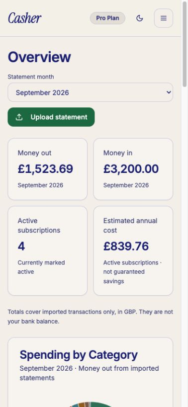
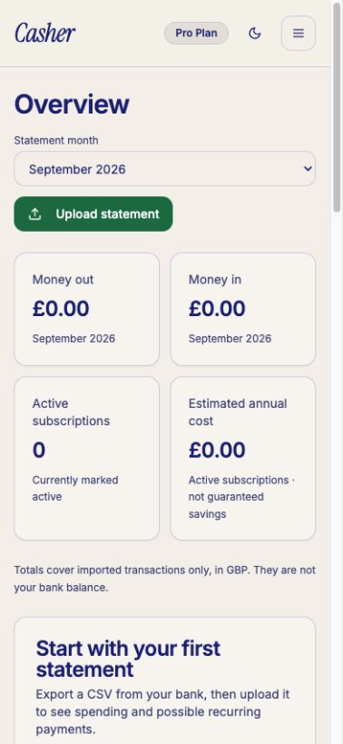
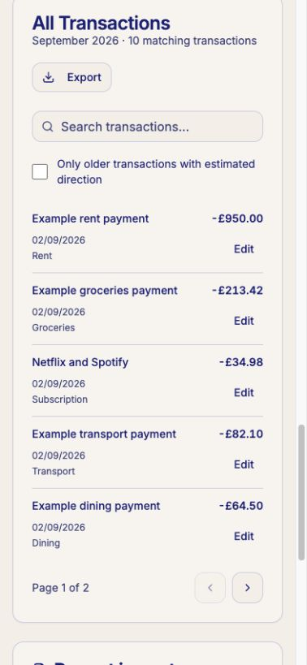
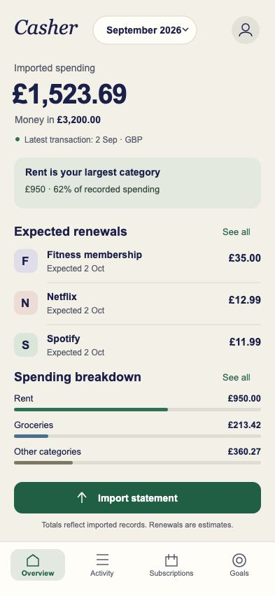

# Casher and BudgetBuddy: product and interface review

Reviewed 11 September 2026. Casher source: `c447392fa98e0986bb3fb55698c3b7696eb1132d`. This is an assessment and design proposal; no application changes or deployment were made for this review.

## Verdict

BudgetBuddy presents a more complete everyday budgeting product. Its visible navigation, transaction lists, category budgets and explanatory insights give users more obvious reasons to return. Casher has useful statement-import and recurring-payment foundations, but its current mobile interface spreads those strengths across a very long dashboard. The earlier defect fixes improved correctness and usability; they did not finish the product design.

The highest-value response is a coherent mobile redesign followed by a small number of useful features. Keep Casher’s warm cream, navy and restrained green identity. Make the first screen answer: **What have I imported? Where is the money going? What should I review next?**

## What was actually examined

- BudgetBuddy’s public website and all six linked product screenshots: budgets, analysis, transactions, category recap, home and dark mode. Its linked Apple and Google store listings were also checked. I did not install it, create an account, test its calculations, or benchmark its speed. Screenshots and advertised features are distinguished below.
- Casher running from the current source with the existing loopback-only synthetic backend. Fresh inspection covered desktop overview, 393 × 852 mobile overview, menu, history, empty and populated renewals, transaction rows/editing, goal creation, upload, dark mode, Account, onboarding and empty-account states. Sample data contained ten current-month transactions, nine prior-month transactions and four subscriptions. These captures contain no owner financial records.
- Current source for navigation, dashboard composition, analytics queries, history, onboarding, import and theme tokens. The phone-sized web review is not a new physical iPhone or VoiceOver certification. Native iOS safe-area spacing and controls can differ; native purchase controls are hidden, unlike the synthetic Pro web account shown here.

Sources: [BudgetBuddy website](https://smartlifeutils.github.io/budgetbuddy/), [Apple listing](https://apps.apple.com/us/app/budget-buddy-expense-manager/id6758464704), [Google listing](https://play.google.com/store/apps/details?id=com.smartlife.budgetbuddy). No competitor reliability, revenue, user-retention or development-effort claims are inferred from screenshots. Store history predates today, so the observed promotion does not establish an initial launch today.

## Where the comparison is useful

| Area | BudgetBuddy evidence | Casher today | Implication |
|---|---|---|---|
| Daily recording | Manual income/expense entry is advertised; an add action is prominent in the home screenshot. | CSV import; existing transactions can have direction/category corrected. | A real scope difference. Manual entry needs reconciliation with later imports, not just another form. |
| Category budgets | Advertised category limits; the budget screenshot shows remaining amount and progress. | No category-limit/budget model found in the current app. | Strongest candidate for the next substantial feature. |
| Recurring payments | Recurring transactions and custom reminders are advertised. | Statement-derived possible subscriptions, estimated renewals, review and verified provider links for supported merchants. No reminder-delivery workflow found. | Make Casher’s existing review workflow prominent; consider optional reminders later. |
| Insights | Screenshots show period analysis and a category-change recap. | Category totals, monthly money-out chart, monthly income/out totals and annualized subscription costs. | Casher can explain more of its existing data without adding more charts. |
| Categories | Website advertises custom categories. | Free-text category correction exists; there is no dedicated category/icon/rule manager. | Do not claim Casher has no customization. Its customization is hard to discover and inconsistent. |
| Savings goals | Goal tracking/milestones are advertised on the website. | Target, manually recorded progress, optional deadline and editing. | Improve visibility and presentation before adding more goal machinery. |
| Appearance | Home shows persistent bottom navigation; light/dark screenshots are available. | Light/dark themes exist; primary destinations are hidden in a menu or buried in the dashboard. | Navigation and information hierarchy are the larger gap. |
| Statement workflow | CSV import and statement-based subscription discovery were not established by the reviewed competitor pages. | These are implemented and have dated physical-device acceptance. | A useful focus for Casher; absence from marketing is not proof the competitor cannot do it. |
| Currency coverage | Dollar examples in screenshots do not establish a supported-currency list. | GBP only, one bank account’s statements. | EUR/currency separation is an independent consideration for the intended UK/EU market. |

Feature claims above come from the [store description](https://apps.apple.com/us/app/budget-buddy-expense-manager/id6758464704) and [website](https://smartlifeutils.github.io/budgetbuddy/). Visible details come from its [home](https://smartlifeutils.github.io/budgetbuddy/assets/images/homescreen.png), [budget](https://smartlifeutils.github.io/budgetbuddy/assets/images/budgets.png), [analysis](https://smartlifeutils.github.io/budgetbuddy/assets/images/charts.png) and [category recap](https://smartlifeutils.github.io/budgetbuddy/assets/images/categories.png) images. Advertised behavior remains untested.

BudgetBuddy also has weaknesses we should avoid copying. Its home uses two large donuts, including a largely single-color income donut; its analysis screenshot has a dense many-color stacked chart, and the budget screen devotes substantial space to a decorative liquid gauge. These can look busy without making decisions easier. Its category-recap image is also different from the customization example suggested by that section’s website caption. [Home screenshot](https://smartlifeutils.github.io/budgetbuddy/assets/images/homescreen.png), [analysis screenshot](https://smartlifeutils.github.io/budgetbuddy/assets/images/charts.png), [budget screenshot](https://smartlifeutils.github.io/budgetbuddy/assets/images/budgets.png), [recap screenshot](https://smartlifeutils.github.io/budgetbuddy/assets/images/categories.png).

## Specific problems in Casher

### 1. The overview is a stack of features, with no clear focal point

In the fresh 393 × 852 populated capture, the page was **3,927 CSS pixels** tall. The first category heading began at y=731, subscriptions at y=1,547, transactions at y=2,476, and goals at y=3,581. These are sample-specific document coordinates, not universal device measurements. No horizontal document overflow was detected in this state.

Four bordered summary tiles occupy much of the first viewport and give recurring-cost estimates almost the same visual weight as the selected month’s spending. A long donut legend then delays the subscription workflow. Every section has a similar card, heading and paragraph, so scanning does not reveal what matters most.

**Change:** a compact month header, one leading spending metric, secondary income/context, one useful observation, and a short upcoming-renewal preview. Move detailed lists and import history to their own destinations. Keep exact amounts accessible in the detailed views.

### 2. The menu hides useful work and promotes secondary controls

The mobile menu presents language, Account, History, Share, optional web Billing and Sign Out. It contains no direct Transactions, Subscriptions or Goals destinations. The header spends room on plan/theme controls. The menu’s settled bounds were correct; an initial capture during its slide animation was discarded rather than reported as clipping.

**Change:** persistent Overview, Activity, Subscriptions and Goals navigation. Put appearance, language, support, plan and sign-out in Account. Account remains reachable from a clear profile control. If budgets are added, evolve Goals into a clearly named planning destination; do not introduce an empty tab early.

### 3. The first-use experience looks empty before it becomes helpful

The empty sample dashboard was **2,949 CSS pixels** tall. Its first-import card began at y=731, below four zero-value tiles. Below that were further empty charts, renewals, transactions, imports and goals. The three onboarding pages explain features but provide no in-product example or bank-specific export help.

**Change:** a purposeful first-use screen with “Import a statement” and “Explore an example,” visible immediately. Provide a clearly labeled synthetic demo isolated from the user account. Explain how to obtain a CSV. Hide irrelevant zero-statistic sections until records exist; preserve useful contextual help.

### 4. Important qualifications have become repetitive interface prose

The overview, category card, subscription introduction, renewal box, individual subscription rows, import history and footer repeat related explanations. The transaction filter “Only older transactions with estimated direction” is visible even in the new sample with no such rows. This foregrounds a historical repair concern for everyone.

**Change:** retain a concise, visible imported-data qualifier and freshness context. Move detailed methodology into well-labeled help or disclosure controls. Show actionable legacy-data review only when relevant. Never hide a warning that changes the reliability of a displayed number.

### 5. Renewals repeat the same merchants without a clear primary action

The renewal panel contains one merchant list, followed by another list with annualized costs and Cancel controls. Switching to October exposes expected dates, but users must discover the selector. The initial month can show an empty renewal message while future renewals exist.

**Change:** default to the next expected renewals, with date, merchant and amount in one list. A merchant detail view can contain frequency, annual cost, last observed payment, confidence/context, editing, provider instructions and the separate mark-as-cancelled action. Keep the distinction between a prediction, an imported payment and an actual provider cancellation explicit.

### 6. Transactions are now usable on mobile but still read like an admin list

Every row repeats a full date, a category line and Edit. The long legacy-data filter precedes the records. Search exists, but there are no obvious income/expense or category chips. Category editing uses a plain text box.

**Change:** date-grouped rows with a small consistent category icon, merchant, secondary category and a right-aligned amount. Make the whole row open details. Put editing inside the detail sheet. Add focused filters and a category picker; retain original imported values and correction history. Do not reduce touch targets to achieve compactness.

### 7. History displays totals without explaining the change

The first mobile viewport has an extra back link, page introduction, card introduction and two stacked month selectors before the chart. Axis labels use `26-08` and `26-09`. Subscription costs on the same page are independent of that date filter, which adds another qualification to understand.

**Change:** readable month labels, a compact period selector with custom dates available secondarily, and a short explanation of the largest observed category changes. Separate subscription projections from historical cash-flow comparisons. Mark missing or partial statement coverage; do not describe a lower imported total as proven savings.

### 8. Upload and settings still use desktop/form language

The phone upload panel says “Drag & drop” and “click to select.” It shows parser rules and bank names before helping the user find a usable file. Account is primarily a long document about exports, clearing and deletion, with uneven navigation compared with the dashboard.

**Change:** use “Choose CSV from Files,” a concise format summary and expandable export instructions. Use a dedicated import flow with selection, validation and result states. Organize Account into short rows leading to Data, Appearance, Help and Account deletion. Keep in-app deletion easy to find and retain its explicit confirmations.

### 9. Dark mode changes the brand character

The light theme’s restrained green becomes a highly saturated bright green in dark mode, while card/background colors become nearly identical. Navy-heavy body text, repeated medium-weight labels and nearly universal borders also flatten the light theme’s hierarchy.

**Change:** define a cohesive dark palette with distinguishable surfaces and a calmer accessible green. Use stronger text selectively for amounts/actions, quieter neutral secondary text, consistent sentence case, fewer nested borders and a predictable spacing scale. Validate contrast and Dynamic Type after implementation.

### 10. Loading needs a separate measured pass

The app already has cached queries and bounded reads. However, the overview/history path reads all transaction pages and builds summaries client-side; the dashboard also mounts several data-heavy sections together. That is a plausible scaling and perceived-speed concern from source inspection. This review did not measure production latency, and competitor screenshots provide no performance evidence.

**Change:** retain usable cached content during refresh, make status local to the affected section, and consider server-side month/category summaries plus separately paginated Activity. Verify correctness against current calculations and preserve strict account isolation. Measure cold/warm launch, route changes, long-history accounts and slow/offline recovery on the real phone before claiming improvement.

## Proposed visual direction

The following is an **original static concept**, not an implemented screen, a competitor copy or an accessibility-certified native layout. It uses the same invented sample amounts. Expected renewals remain labeled as estimates, and the latest transaction date stays visible. It demonstrates hierarchy and navigation; production implementation must accommodate safe areas, 44-point targets, larger text and missing-data states.

| Current first viewport | Proposed direction |
|---|---|
|  |  |

## Recommended order of work

| Order | Deliverable | Why first / completion check |
|---|---|---|
| 1 | Prototype the mobile shell and Overview, Activity, Subscriptions, Goals and Account screens. | Establish one coherent visual system. Existing core destinations must be reachable in one tap; the first screen must expose the imported period, main number and next useful action. |
| 2 | Implement that navigation and reorganize existing capabilities. | Fix discoverability without waiting for new financial models. Preserve caches, correction history, deletion and imported-data qualifications. |
| 3 | Replace empty/onboarding/import states and tighten transaction/renewal details. | Make first value obvious and reduce effort. A new user can explore synthetic example data and find bank CSV guidance without entering real financial data. |
| 4 | Add a focused category-budget model. | Real feature gap. Begin with monthly per-category targets against imported spending, optional templates and clear remaining/overspent amounts. Partial imports must be visible. Test month boundaries, refunds, income/transfers, currency separation and updated imports. |
| 5 | Add useful explanations, category management and optional reminder delivery. | Show which recorded categories changed and which renewals deserve review. Every insight must reconcile to source records. Reminders need consent, editable timing, cancellation and stale-data handling. |
| 6 | Evaluate manual transactions and EUR support as explicit product expansions. | Both affect data modeling, duplicate reconciliation and reporting. The intended UK/EU positioning requires an honest supported-currency statement. |

Casher’s free tier currently permits one CSV upload per month. That can suit a monthly statement review, but does not support a credible continuously current budget by itself. If daily budgeting becomes the promise, revisit data freshness and update options. Do not label an imported net figure “safe to spend” or a current bank balance.

Avoid prioritizing streaks, decorative gauges, a stories interface, arbitrary AI insights, more donut charts, bank connectivity or purchases just to match screenshots. Casher already has enough functionality to justify a much better first impression. The next implementation should make its statement review and subscription workflow feel finished, then add category budgets deliberately.

## Evidence and source locations

Fresh screenshots are in `docs/design-audit/assets/budgetbuddy-20260911/`. In addition to the figures above: [menu](assets/budgetbuddy-20260911/casher-menu.png), [history](assets/budgetbuddy-20260911/casher-history.png), [upcoming renewals](assets/budgetbuddy-20260911/casher-upcoming-renewals.png), [transaction editor](assets/budgetbuddy-20260911/casher-edit-transaction.png), [goal form](assets/budgetbuddy-20260911/casher-goal-form.png), [upload](assets/budgetbuddy-20260911/casher-upload.png), [dark mode](assets/budgetbuddy-20260911/casher-dark.png), [Account](assets/budgetbuddy-20260911/casher-account.png), [onboarding](assets/budgetbuddy-20260911/casher-onboarding.png), [full populated dashboard](assets/budgetbuddy-20260911/casher-dashboard-full.png).

Relevant implementation: `src/pages/Dashboard.tsx`, `src/components/DashboardHeader.tsx`, `src/components/DashboardSummaryCards.tsx`, `src/components/CategoryChart.tsx`, `src/components/TransactionsTable.tsx`, `src/components/SubscriptionsList.tsx`, `src/pages/History.tsx`, `src/pages/Account.tsx`, `src/components/CSVUpload.tsx`, `src/components/OnboardingModal.tsx`, `src/hooks/useStatementData.ts`, `src/hooks/useDashboardData.ts`, `src/index.css`.

Existing launch restrictions remain in force. This review created local documents and design assets only. It did not change production records, billing/banking, app submission state or the installed phone app.
