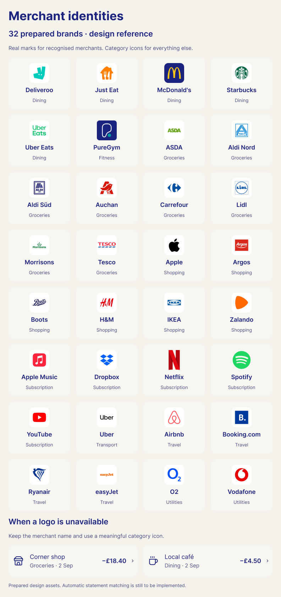

# Merchant identities — prototype and implementation handoff

**Implementation update, 12 September:** the owner subsequently authorised implementation. The matcher and 32 bundled logo images are now connected to transaction lists, subscriptions, expected renewals and both detail dialogs. A signed development build was installed and launched on the connected iPhone 15 Pro. The historical design plan below is retained; the implementation details and limitations are recorded in the final section.

The owner asked for automatic merchant logos across imported statements, preserving Casher's original colours. The Figma examples originally covered four brands. The design catalogue now contains 32 merchant/product marks, with a matching visual board in the existing Figma file. This is prepared design material, not an automatic lookup in the installed app.

## Prepared assets

[Catalogue and provenance](assets/figma-mobile-v1/merchant-catalogue/catalogue.json) records each asset, source, checksum and available upstream guidelines/licence metadata. The SVG/PNG sources total 57,596 bytes. The assets have not been added to the production bundle.

- Supermarkets: Tesco, ASDA, Morrisons, Lidl, Aldi Nord, Aldi Süd, Auchan, Carrefour.
- Shopping: Argos, Boots, IKEA, H&M, Zalando, Apple.
- Food and transport: Deliveroo, Just Eat, McDonald's, Starbucks, Uber Eats, Uber.
- Subscriptions and fitness: Netflix, Spotify, PureGym, Apple Music, YouTube, Dropbox.
- Travel: Airbnb, Booking.com, easyJet, Ryanair.
- Mobile: Vodafone, O2.

Netflix, Tesco and PureGym retain the previously recorded official website artwork. The other 29 use [Simple Icons](https://github.com/simple-icons/simple-icons), pinned to revision `b054428646591252023b9599defb56f6e0b32f10`; this includes a sharper vector replacement for the earlier 32px Spotify image. These are actual brand shapes; some are single-colour variants. Source artwork is retained unchanged; the Figma presentation adds padding/background and the recorded brand colour. Upstream licence and disclaimer are included. Catalogue availability is not a claim of approval for every production or marketing use.

[View the logo board in Figma](https://www.figma.com/design/HFA81FN7TV8hqVpSXXMmh1/Casher-Mobile-prototype-v1?node-id=50-636). Two sample rows show the store and café icon fallbacks, using the existing Casher Row component. The board retains the original colour tokens and Inter typography. All examples are invented.

## Automatic behaviour to implement after prototype review

1. Preserve the original statement description, merchant field, amount, direction and category. A logo match is display metadata, never a reason to rewrite imported financial data or infer a subscription.
2. Normalise case, Unicode, whitespace and known bank/payment-processor prefixes into a separate lookup string. Match specific, reviewed descriptor aliases at token boundaries. Never strip arbitrary prefixes until a familiar brand happens to match.
3. Resolve to a canonical merchant ID and bundled asset. Use the same identity in Activity, Subscriptions, renewal details and search. Specific products take precedence over parents: Uber Eats before Uber; Apple Music before Apple.
4. Unknown or ambiguous descriptions keep their name and receive a category icon. No initial-only circles, empty image slots or invented company marks. If the category is also unknown, use a receipt/store icon.
5. Keep the original descriptor visible in transaction detail so a user can spot mistakes. Any merchant correction must be explicit and scoped; it must not update other users' data or grant a provider an unverified cancellation URL.
6. Display a local fallback immediately, including offline and when an image fails. Asset loading must not block transactions, totals or navigation, and must reserve the same dimensions to prevent layout movement.
7. Expand the reviewed catalogue with app releases. Larger external coverage is a separate integration decision: the app must not send raw statement descriptions, amounts, names or account identifiers to arbitrary logo services.

## Ambiguity examples

| Statement text | Intended identity behaviour |
|---|---|
| `TESCO STORES 1234` | Tesco once its descriptor rule is added |
| `NETFLIX.COM` | Netflix |
| `PURE GYM LTD` | PureGym |
| `PAYPAL *SPOTIFY` | Spotify via a reviewed processor wrapper |
| `UBER *EATS` | Uber Eats, not the ride service |
| `APPLE.COM/BILL` | Apple billing; do not infer Apple Music |
| `ALDI` | Do not choose Nord or Süd without stronger evidence |
| `THE APPLE TREE CAFE` | Café fallback; not Apple |
| `GYM MEMBERSHIP` | Fitness fallback; not PureGym |
| `PAYPAL` / `SUMUP` | Do not invent the underlying merchant |
| `CORNER SHOP 84` | Groceries/store fallback and original name |

These are acceptance examples, not claims that the existing app already matches them. Current `extractMerchant()` in `supabase/functions/_shared/csv-parser.ts` only cleans/truncates descriptions; it does not resolve a merchant catalogue. The current transaction/subscription components contain no automatic brand-image lookup.

## Required implementation checks

- Descriptor aliases, exact token boundaries, parent/product precedence and unknown/ambiguous names.
- Existing and new imports, refund/credit/debit amounts and raw descriptions remain unchanged.
- Known image, unknown merchant, unavailable image and offline behaviour show usable rows with no layout movement.
- Shared identity across Activity, Subscriptions and detail; long names, large text, dark mode and VoiceOver.
- No external logo requests containing statement data; no new subscription or paid API dependency.

The 32 prepared identities demonstrate broad categories, not a measured coverage percentage for UK/EU bank statements. No catalogue can guarantee the correct logo for every independent business or opaque card descriptor.

## Implemented and verified

- `src/lib/merchant-identity.ts`: local descriptor normalisation, reviewed prefix/alias rules, product precedence, conservative conflicts and canonical-name search. Existing and newly imported records receive identities at display time; no database migration or stored financial values change.
- `src/components/MerchantMark.tsx`: fixed-size decorative marks with immediate Lucide category fallbacks, hidden duplicate screen-reader labels, image-error handling and fresh state when the merchant changes. The original 40-point logo slot and Casher theme are retained. Original descriptors remain in detail views and CSV export; debit/credit signs remain intact, including the transaction detail amount.
- `src/assets/merchants/catalogue.json` and `public/merchants/`: 32 immutable, content-versioned PNGs exported from the approved Figma artwork. Every image was checked against its Figma image hash and recorded SHA-256. Total logo image bytes: 174,540. Runtime requests are local app/site assets; there is no external logo API or statement-data transmission for matching.
- Public Figma download URLs returned empty HTTP 202 responses. The exact original image bytes were instead retrieved through Figma's authorised `getImageByHash().getBytesAsync()` API; no asset was recreated, enlarged or substituted by guesswork. Temporary signed URLs are not committed.
- Validation: 315 unit tests passed, including 52 merchant tests; 20 Chromium browser cases and six WebKit cases passed. These cover original/canonical search, signed refunds/spending, synthetic CSV import and refresh, unknown/ambiguous identities, stalled/failed images, offline interaction with already loaded data, 320/393px layouts, large text, dark mode and automated accessibility. Typechecks and build passed; lint has zero errors and the seven pre-existing warnings.
- iOS: Release compilation and strict signature verification passed using the existing development team. All 32 images were independently verified inside the signed bundle, associated-domain entitlement retained, and no development-server URL configured. `devicectl` confirmed installation and launch on the connected physical iPhone. This does not claim a fresh physical statement import, manual VoiceOver acceptance or App Store distribution readiness.

The scope is automatic merchant presentation, not the full Figma navigation redesign. Unknown merchant correction/catalogue expansion remain future work; generic Aldi is intentionally unresolved between Nord and Süd. Web bootstrap while fully offline is not implemented by this change: native assets are bundled, and an already loaded web view can retain usable rows/fallbacks. Production website deployment and release gates were not changed. Test imports and record mutations occurred only in the loopback synthetic backend; owner account records were untouched.

Browser screenshots and build evidence are under `.audit-results/merchant-identities/`.

Signed development archive: `release-artifacts/ios/Casher-MerchantLogos-20260912.zip`, SHA-256 `51b3408a76aac838b2a71f47b404390ce732f5869371d4300565aca48ba3f15c`. The old archive inspector only handles unsigned device archives with a fixed bundle name; a separate inspection verified this signed `App.app` archive's arm64 executable, version, production API, privacy/configuration and all logo checksums. See `signed-archive-inspection.json` in the evidence directory.

[Implemented phone-width preview, using synthetic transactions](assets/figma-mobile-v1/merchant-runtime-393.png).

