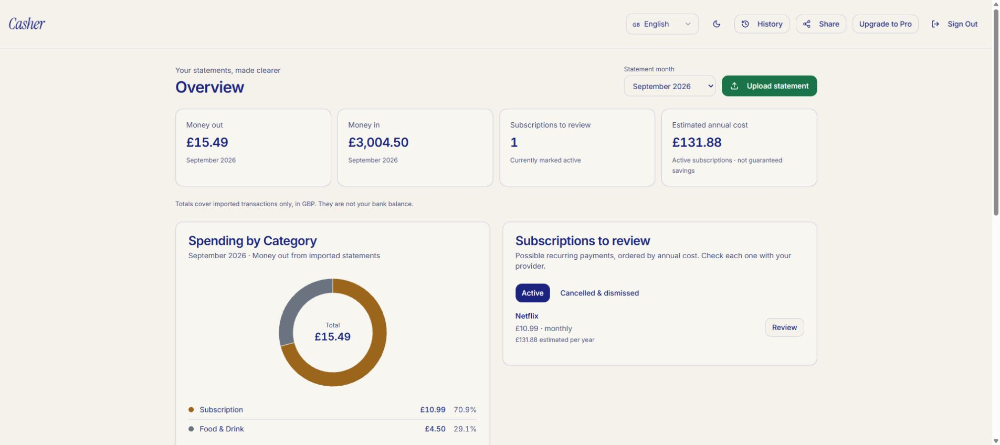

# Casher production deployment — 6 September 2026

**The corrected application is published at [trycasher.com](https://trycasher.com), with live Stripe billing configured.** The remaining customer-facing launch item is a confirmed support/privacy destination: the advertised `privacy@trycasher.com` has no receiving mail service configured. The owner has been asked which working address to publish.

This report supersedes the deployment blockers in the [earlier release report](release-check-20260906.md). [PR #2](https://github.com/DannyWolfofTech/Casher/pull/2) is merged. Published application commit: `4989ae79d38dc021f09eccc89cded9787f4ef45f`. Both jobs in its [GitHub Actions run passed](https://github.com/DannyWolfofTech/Casher/actions/runs/34062828381). Lovable deployment ID: `b594f889-c735-448b-b404-6fb95368f7d6`.

## Deployed changes

- Contained, responsive spending donut; matching category amounts/percentages and money-out totals; integer-pence arithmetic; debit/credit handling; complete transaction pagination.
- Strict GBP CSV imports; repeated-purchase preservation; overlap/replay detection; atomic quota enforcement and rollback.
- Owner-only transaction/subscription corrections with preserved imported values, review history and stale-edit protection; savings goals; account cache isolation; reliable loading/error/recovery states; mobile and dark-mode fixes.
- Server-selected Pro pricing, account verification, reusable checkout, protected legacy checkout URL, current-state billing reconciliation and strict signatures/environment checks.
- Branded authentication emails, pinned edge packages, portable dependency lock, fresh database startup and comprehensive CI. Unfinished Premium/bank connections remain unavailable.

All ten changed cloud functions were deployed: `process-csv`, `check-subscription`, `create-checkout`, `create-checkout-session`, `customer-portal`, `stripe-webhook`, `check-failed-webhooks`, `send-welcome-email`, `auth-email-hook` and `process-email-queue`.

The cloud migration registry contains `20260904220000_atomic_statement_import`, `20260904230000_statement_corrections` and `20260906220000_review_conflict_status`. The last migration fixes a cloud-only hanging correction response by returning PostgREST `PT409`; the frontend understands both the new and previous conflict codes. Lovable's bundler also required the checkout handler under `_shared`; both endpoint names now import the same handler.

## Stripe account and configuration

The existing **Casher sandbox**, `acct_1SCrpvJMS012Ip2A`, belongs to the original **SpendLeak** live account, `acct_1SCrpiJXnVWNQOUC`. The account switcher and authenticated account API verified the relationship. They are not two unrelated business accounts.

| Production setting | Verified value |
|---|---|
| Account/mode | `acct_1SCrpiJXnVWNQOUC` / `live` |
| Product | `prod_VDEAMCQCBa7bA5`, Casher Pro |
| Monthly price | `price_1UCnhkJXnVWNQOUCTniCuVEo`, GBP 999 pence |
| Default portal | `bpc_1UCo9LJXnVWNQOUCNm8If6Yf` |
| Active webhook | `we_1UCoCSJXnVWNQOUCjCigFYFj` |
| API version | `2025-08-27.basil` |

The owner completed Stripe's email/authenticator verification. A restricted production key and the correct webhook signing secret are stored in Lovable's secret store, with explicit account/mode/price settings. The key has only the customer, catalogue, subscription, checkout, portal and account-read permissions required by this integration.

Stripe reports charges and payouts enabled. Public trading name is now **Casher**, with **https://trycasher.com** and current privacy/terms links. The existing `CASHER` statement descriptor and legal identity were preserved. The portal allows invoice history, payment-method updates and period-end cancellation; unavailable plan switching is disabled.

The live webhook listens for checkout completion, subscription creation/update/deletion, and invoice paid/payment-succeeded/payment-failed. The sandbox endpoint was repaired with its actual signing secret and the same seven events, tested successfully, then disabled after the live switch so it no longer sends test events to a live deployment.

## Acceptance evidence

| Check | Result and boundary |
|---|---|
| Types, lint, tests and build | Passed; 218 tests, no lint errors, seven existing Fast Refresh warnings |
| Browser regression | 22/22 passed; real frontend with synthetic backend at 320/390/768/1440px |
| Latest CI | Both jobs passed: app/browser/edge checks and clean full Supabase |
| npm application dependency audit | No known vulnerabilities |
| Connected cloud API acceptance | 8/8 passed using two real temporary Auth users, deployed functions and actual cloud database |
| Hosted sandbox payment | Stripe test Visa succeeded; real Stripe-to-cloud delivery granted Pro before any subscription-refresh call |
| Hosted sandbox cancellation | Portal retained access until period end; final cancellation correctly removed Pro |
| Live checkout/portal | Correct live account and GBP 9.99 price; reusable unpaid checkout and working live portal; no payment submitted |
| Live webhook configuration | Invalid signature and wrong mode rejected; signed synthetic live-customer reconciliation accepted twice |
| Public domains | 12/12 HTTPS route checks: apex/www landing, auth, dashboard, pricing, privacy and terms |
| Published browser | Actual cloud login, chart, correction, matching persisted totals after reload and sign-out passed |
| External mail | Signup-template test and actual recovery email both arrived in the owner's Yahoo inbox; recovery queue recorded sent |

Connected import checks covered repeated purchases, exact debit/credit totals, replay/quota rejection without partial writes, account isolation, correction ownership/audit history/stale edits, goals, billing-account verification and unavailable Premium rejection. Both checkout URLs reused the same session.

All six relevant real payment/cancellation deliveries succeeded in the connected cloud: checkout completion, subscription creation/update/deletion, invoice paid and invoice payment succeeded. Older renewal/failure/retry/stale-event tests are recorded in the earlier report and were run in isolated/full local environments. Test counts overlap and must not be added into a claim of distinct requirements.

The live webhook check was a signed integration probe for an unpaid synthetic customer, **not a live payment**. No real card was charged. The live checkout was expired and its synthetic customer deleted afterward.

Email confirmation is required; secure email changes and compromised-password checking are enabled. Casher's form requires eight-character passwords. Lovable's server-minimum field did not retain an attempted explicit value, so no server-minimum change is claimed. Google is enabled in configuration; a new end-to-end Google consent/login was not completed in this pass. The owner's recovery email was delivered without replacing their password.

## Preservation and cleanup

A private pre-deployment snapshot of affected records and schema was saved outside source control. Each of the four original Stripe customer bindings was independently retrieved from the sandbox before removing those obsolete test billing links/paid tiers. Their statements were preserved; they can now create valid live billing relationships.

Both temporary cloud users, their imports/reviews, the synthetic sandbox subscription/customer and the unpaid live checkout/customer were cleaned up. Afterward, the original **29 profiles, 490 transactions and 60 detected subscriptions** remained, with no cloud billing links to deleted test customers.

Historical payment directions that the old importer did not preserve remain marked for review. They cannot be reconstructed from code alone. Users must compare them with original statements; corrections retain the imported values. Historical financial accuracy was not certified against bank originals.

## Remaining operating decisions

- Confirm the public support/privacy address before inviting paying customers. Working outbound authentication email does not establish a receiving inbox for `privacy@trycasher.com`.
- Assign ongoing backup retention and test a restore. The private rollback snapshot is not a verified managed backup/point-in-time recovery policy.
- Source/runtime testing does not establish legal/privacy compliance, tax obligations or the correctness of legacy financial records. These need the owner's operating decisions and source documents.
- Monitor new live webhook failures in Stripe and `webhook_events`. Old failed sandbox deliveries remain historical; the successful release events were checked individually.
- Deletion was exercised on the temporary users: delete their exact upload-history rows, then their authenticated user; profiles, transactions, goals, detected subscriptions and review history cascade. For real requests, verify identity, handle the billing subscription deliberately and follow the agreed retention policy. Do not identify a billing customer solely by a supplied email address.

## Reproduction and secret handling

Use the repository CI workflow for clean database/edge checks; run `npm run check` and `npm run test:browser` locally. `tools/billing-sandbox/verify-cloud.mjs` requires explicitly created disposable `casher-release-…@example.test` users and refuses live checkout sessions. It leaves those users available for hosted payment testing and requires cleanup afterward. Do not run it against a deployment configured for live billing.

Keep credentials in ignored local files or the service secret store. Never include them in a `VITE_` variable, report, screenshot or commit.
